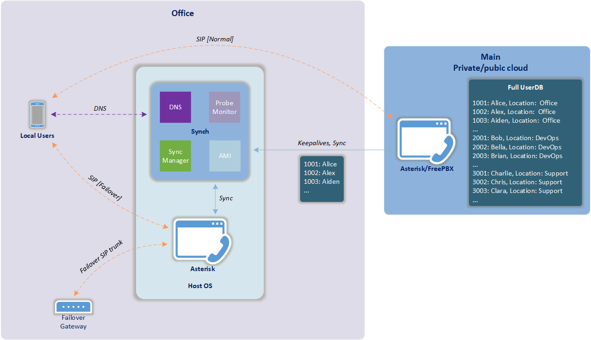
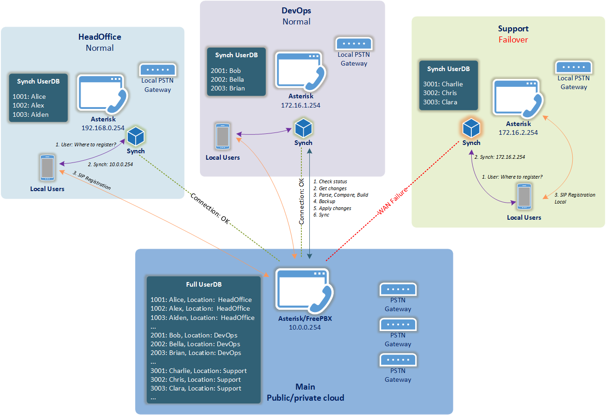

# Synch
Ordinary solution for Asterisk/FreePBX resilient branch site telephony system.

Synch addresses a few particular technical challenges that inevitably arise when one builds a central call-processing multi-site telephony system on Asterisk/FreePBX.

These challenges are:
- Provide local site call-processing resiliency during main system outage or network connection loss.
- Keep in-sync central system user accounts and configurations with remote sites.
- Automatic failover and fallback.
<br></br>
## Architecture


### v1.0b Features
- Connection health monitor
- Synchronisation of user configurations between central and branch sites
- Filtering
- Embedded DNS server to handle phone registrations
- Easy remote monitoring
- Configuration changes versioning
- System service

### Roadmap
- Context synchronisation
- Dynamic dialplan generation
<br></br>
## Scenario


1. Main Asterisk/FreePBX system is configured with all users and their features, applications, voicemails etc.
2. Basic Asterisk installation is deployed on each site that requires resiliency. Depending on scale of the site, Asterisk may be installed on anything starting from Raspberry Pi and upwards.
3. Synch is installed on top of each Asterisk and then integrated with the main system via Asterisk Manager Interface (AMI).
4. Synch periodically checks changes and synchronises user accounts for its site. To do that you set up a filter that matches a subset of users specific to a site.
5. Synch monitors connection to the main system and provides handsets failover and fallback using its embedded DNS server for this purpose.
<br></br>
## Download
Synch has to be downloaded and installed on each remote site that requires resiliency and local call-processing. It's recommended to install synch from same system user that runs Asterisk process on that site.

### Prerequisites
- Main site: Installed and configured instance of Asterisk/FreePBX. Users created and configured.
- Synch site: Basic installation of Asterisk deployed.

#### Choose distribution method
There are two options to download the application:
- Build from source files (requires .NET Core SDK 2.2+) or
- Download self-contained release packaged with essential .NET Core libraries and runtime.

### Build from source files (recommended)

#### Install .NET Core SDK
##### CentOS
```bash
sudo rpm -Uvh https://packages.microsoft.com/config/rhel/7/packages-microsoft-prod.rpm
sudo yum update
sudo yum install dotnet-sdk-2.2
```

##### Debian
```bash
wget -qO- https://packages.microsoft.com/keys/microsoft.asc | gpg --dearmor > microsoft.asc.gpg
sudo mv microsoft.asc.gpg /etc/apt/trusted.gpg.d/
wget -q https://packages.microsoft.com/config/debian/9/prod.list
sudo mv prod.list /etc/apt/sources.list.d/microsoft-prod.list
sudo chown root:root /etc/apt/trusted.gpg.d/microsoft.asc.gpg
sudo chown root:root /etc/apt/sources.list.d/microsoft-prod.list
sudo apt-get install apt-transport-https
sudo apt-get update
sudo apt-get install dotnet-sdk-2.2
```

#### Clone and build synch

Assuming that Asterisk system user is **`asterisk`**:
```bash
cd /home/asterisk
mkdir -p src && cd src
git clone https://github.com/xf86cfg/synch.git
cd synch
chmod +x *.sh
./build.sh
```

### Download self-contained release (alternative)

Assuming that Asterisk system user is **`asterisk`**:
```bash
cd /home/asterisk
mkdir -p publish && cd publish
wget https://github.com/xf86cfg/synch/releases/download/v1.0b/synch-linux-x64.tar.gz
tar -zxvf synch-linux-x64.tar.gz && cd synch-linux-x64
sudo chmod +x *.sh
```
<br></br>
## Installation
Regardless of what method of distribution has been chosen, installation process is exactly same:
```bash
sudo ./install.sh
```
<br></br>
## Configuration

### Prerequisites

- Main system AMI configuration file **`manager.conf`** configured similar to below:
```
[general]
enabled = yes
port = 5038
bindaddr = 10.0.0.254
[synch]
secret = SomePasswordHere
read = all
write = 
```

- Local AMI configuration file **`manager.conf`** configured similar to below:
```
[general]
enabled = yes
port = 5038
bindaddr = 127.0.0.1
[synch]
secret = SomePasswordHere
read = all
write = all
```

### Application Settings
Assuming that Synch has been installed in default directory **`/opt/synch`**, open configiuration file **`/opt/synch/appsettings.json`** in text editor and adjust settings.

You may leave default settings as it is and adjust only specific settings for your site marked with yellow below: 
<pre>
{
  "loglevel": {
    "default": "information" <font color="silver">//Accepted values: Trace, Debug, Information, Warning, Error, Critical</font>
  },
  "probemonitor": {
    "failureTolerance": 5, <font color="silver">//Number of consequent probes that have to fail to consider the main system as Failed and to initiate failover mode</font>
    "aliveThreshold": 5, <font color="silver">//Number of consequent probes that have to succeed to consider the main system as Stable and to initiate fallback mode</font>
    "errorPenaltyPoints": 1, <font color="silver">//Penalty points for each error on TCP/IP stack level</font>
    "interval": 5 <font color="silver">//Probe interval (seconds)</font>
  },
  "amiremote": { <font color="silver">//AMI details of the main system</font>
    "hostname": "<mark>10.0.0.254</mark>",
    "port": <mark>5038</mark>,
    "username": "<mark>synch</mark>",
    "password": "<mark>SomePasswordHere</mark>"
  },
  "amilocal": { <font color="silver">//AMI details of the local site system. Hostname is not required as this is a localhost</font>
    "port": <mark>5038</mark>,
    "username": "<mark>synch</mark>",
    "password": "<mark>SomePasswordHere</mark>"
  },
  "syncmanager": {
    "remotefilename": "sip_additional.conf", <font color="silver">//User accounts confguration file on the main system, sip_additional.conf is a common file that contains user accounts</font>
    "interval": 300, <font color="silver">//Synchronisation interval (seconds)</font>
    "filterkey": "<mark>accountcode</mark>", <font color="silver">//Filter key</font>
    "filtervalue": "<mark>^HeadOffice$</mark>", <font color="silver">//Regex filter value</font>
    "localconfigspath": "/etc/asterisk/" <font color="silver">//Path to local site Asterisk config directory with trailing "/"</font>
  },
  "dnsservice": {
    "listenaddress": "<mark>192.168.0.254</mark>", <font color="silver">//Synch DNS socket</font>
    "domain": "<mark>example.local</mark>", <font color="silver">//Internal zone for SIP record</font>
    "record": "<mark>sip</mark>", <font color="silver">//SIP record (sip.example.local)</font>
    "recordttl": 300, <font color="silver">//SIP record TTL (seconds)</font>
    "targetnormal": "<mark>10.0.0.254</mark>", <font color="silver">//Main Asterisk system IP address</font>
    "targetfailover": "<mark>192.168.0.254</mark>", <font color="silver">//Local site Asterisk system IP address</font>
    "forwarder": "<mark>1.1.1.1</mark>", <font color="silver">//Forwarder for all other DNS requests</font>
    "refreshinterval": 300, <font color="silver">//SOA Refresh (seconds)</font>
    "retryinterval": 300, <font color="silver">//SOA Retry (seconds)</font>
    "expireinterval": 300, <font color="silver">//SOA Expire (seconds)</font>
    "minttl": 300, <font color="silver">//SOA Minimum TTL (seconds)</font>
    "ttl": 300, <font color="silver">//SOA Default TTL (seconds)</font>
    "defaultstate": "Failover" <font color="silver">//Initial state when service starts up. Accepted values: Normal, Failover</font>
  },
  "servicecontrol": { <font color="silver">//Monitoring settings</font>
    "token": "<mark>token1</mark>", <font color="silver">//Authentication token. Consider making unique token for each site</font>
    "listenaddress": "127.0.0.1", <font color="silver">//Monitoring socket</font>
    "port": 65038 <font color="silver">//Monitoring port</font>
  }
}
</pre>

### Add reference to Synch users
Assuming that main SIP configuration file on the site Asterisk system is **`/etc/asterisk/sip.conf`**:
```bash
sudo echo "#include \"sip_synch.conf\"" >> /etc/asterisk/sip.conf
```
Your local main SIP configuration file must not contain any user accounts. User accounts are synchronised from the main system to `sip_synch.conf` and therefore reference is required.
Though, you may use main SIP configuration file to store trunk settings, templates etc.

### Phone settings
1. Instruct handsets to use Synch DNS socket for DNS queries. This can be achieved in many ways: DHCP, phones provisioning server, phones configuration templates or through adjusting manual settings on the phones.

2. You may or may not need to set up SIP Registration Expiry timer on the handsets to match TTL value of the SIP record **`sip.example.local`**.
Some handsets fully rely on TTL value of a SIP server DNS record and when it expires, they query DNS server and then re-register to a new IP address if it changed.
Whereas some handsets re-trigger DNS query only when their registration timer expires.
The general approach to this is to make a few failover/fallback tests without touching SIP Registration Expiry on the handsets. If handsets don't switchover as expected, you will need to adjust SIP Registration Expiry timer as explained above.

### Using synchronisation filter
Synch doesn't have to synchronise all user accounts from the main system. Instead, it has to copy only a subset of users related to a site Synch looks after.
To instruct Synch what particular user accounts have to be kept in-sync you need to think about a filter key and a pattern that describes those users.

Considering current example let's have a look at **`sip_additional.conf`** on the main system:

```
[1001]
callerid=Alice <1001>
permit=192.168.0.0/255.255.255.0
dial=SIP/1001
mailbox=1001@default
context=from-internal-headoffice
accountcode=HeadOffice
...
```
```
[1002]
callerid=Alex <1002>
permit=192.168.0.0/255.255.255.0
dial=SIP/1002
mailbox=1002@default
context=from-internal-headoffice
accountcode=HeadOffice
...
```
```
[1003]
callerid=Aiden <1003>
permit=192.168.0.0/255.255.255.0
dial=SIP/1003
mailbox=1003@default
context=from-internal-headoffice
accountcode=HeadOffice
...
```
```
[2001]
callerid=Bob <2001>
permit=172.16.1.0/255.255.255.0
dial=SIP/2001
mailbox=2001@default
context=from-internal-devops
accountcode=DevOps
...
```
```
[3001]
callerid=Charlie <3001>
permit=0.0.0.0/0.0.0.0
dial=SIP/3001
mailbox=3001@default
context=from-internal-support
accountcode=Support
...
```
```
[Dev_Trunk]
disallow=all
type=peer
nat=no
allow=alaw
context=from-trunk-sip-Dev_Trunk
...
```
```
[Prod_Trunk]
disallow=all
type=peer
nat=no
allow=alaw
context=from-trunk-sip-Prod_Trunk
...
```

As you may see, there are current configuration sections for users and for some trunks.
Let's say for this particular site we want to synchronise just users from HeadOffice department. There are a few patterns that can help. For instance:

1. Matching **`accountcode`**. This is one of the most common ways to distinguish between different user groups. In FreePBX distro, account code can be easily assigned through GUI in Advanced settings of the extension:
    ```json
    "syncmanager": {
        "filterkey": "accountcode",
        "filtervalue": "^HeadOffice$"
    }
    ```
2. Matching allowed network (192.168.0.0/24):
    ```json
    "syncmanager": {
        "filterkey": "permit",
        "filtervalue": "^192\.168\.0\.[0-255]\/255\.255\.255\.0$"
    }
    ```
3. Matching **`dial`** destination:
    ```json
    "syncmanager": {
        "filterkey": "dial",
        "filtervalue": "^SIP\/1[0-9][0-9][0-9]$"
    }
    ```
4. Matching **`context`** if user accounts for remote sites belong to different contexts:
    ```json
    "syncmanager": {
        "filterkey": "context",
        "filtervalue": "^from\-internal\-headoffice$"
    }
    ```
5. You can also match section name in square brackets (e.g. [1001]) by using a reserved key **`categoryname`** and a value:
    ```json
    "syncmanager": {
        "filterkey": "categoryname",
        "filtervalue": "^1[0-9][0-9][0-9]$"
    }
    ```
Once **`appsettings.json`** is configured and saved, it's time to run the application.
<br></br>
## Run application

### Prerequisites
- Main Asterisk/FreePBX is up and running
- Local site Asterisk is up and running
- Synch installed and configured on local site

##### Run as a user application
Assuming that Synch has been installed in default directory **`/opt/synch`**:
```bash
/opt/synch/synch
```

##### Run as a Linux service
```bash
sudo systemctl start synch
```
<br></br>
## Basic monitoring
To monitor status of the application you can connect to a monitoring socket (default 65038) and send a command in the format **`Command(<token>)`**.
Currently only **`GetStatus()`** command supported.
```bash
echo "GetStatus(token1)" | nc 127.0.0.1 65038
[{"Timestamp":"20190522181925","Monitor":"Stable","Sync":"Synced","Service":"Normal"}]
```
**`Monitor`** - represents keepalives state. Possible values are: `Init`, `Unstable`, `Failed`, `Stable`\
**`Sync`** - represents synchronisation state. Possible values are: `Init`, `Unsynced`, `Synced`\
**`Service`** - represents failover state. Possible values are: `Init`, `Failover`, `Normal`
 
<br></br>
## Uninstall
Assuming downloaded source is in **`/home/asterisk/src/synch`**:
```bash
cd /home/asterisk/src/synch
sudo ./uninstall
```
